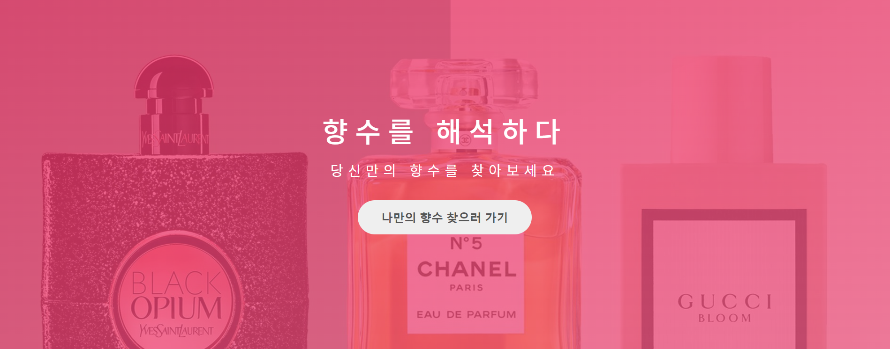

# 향:해

`향수를 해석하다`  `향수 고수를 향해 가다`



**향기는 기억이다. 좋았던 그 시절, 그 공간, 그 사람에게로 빠르게 추억 시계를 되감아 주는 태엽 장치다.**

> 어떤 향수를 써야할지 모르겠나요? 나한테 딱 맞는 향수를 찾고 싶나요?<br>
>
> 나의 패션, 라이프스타일, 관심사에 따라 향수를 찾아보세요.<br>
> 향수만큼 취향을 타는 것도 없어요!
>
> ''향린이''에서 ''향잘알''을 **향해** Go Go ! 

<br><br>

## 프로젝트 목차
- [향:해](#향해)
  - [프로젝트 목차](#프로젝트-목차)
  - [서비스 소개](#서비스-소개)
    - [📋 기술 스택](#-기술-스택)
  - [프로젝트 파일 구조](#프로젝트-파일-구조)
    - [Backend](#backend)
    - [Frontend](#frontend)

  - [산출물](#산출물)
  - [결과물](#결과물)

- [📺 프로젝트 UCC](https://drive.google.com/drive/folders/19nDtGa64AudWwS5Fxjrk2entle-rCwhH)
  <br><br>

## 서비스 소개

1. 개발 기간 : 2022.02.28 ~ 2022.04.08 (총 6주)
   - Sub1 : 2022.02.28 ~ 2022.03.04
   - Sub2 : 2022.03.07 ~ 2022.03.18
   - Sub3 : 2022.03.21 ~ 2022.04.08
2. 인원 (총 6인)
	 - 김다은 (Alice) : 팀장, Back-end, Machine Learning, Spring Boot
	 - 김민성 (Scarlet) : Front-end 테크리더, React, TypeScript, Jest
	 - 김서인 (Wendy) : Front-end, Design, Test, UCC
	 - 김은준 (David) : Back-end 테크리더, DB 모델링, Spring Boot
	 - 문관필 (Woody) : Back-end, AWS EC2, Spring Boot
	 - 박창건 (Jackson) : Front-end, Design, Redux

<br><br>

### 📋 기술 스택

1. 이슈관리 : 
2. 형상관리 : 
3. 커뮤니케이션 : 
4. 개발 환경
	- OS : 10
	- IDE
	  -  2021.3.1
	  -  1.66.0
	  - UI/UX : 
	- Database : 
	- Server : 
		-   
5. 상세 사용
	- Backend
		-   (Zulu Open JDK 11)
		-   (Spring Boot 2.4.5)
		-  7.4
		-  </img>, </img>3.0.0, </img>
	- Frontend
		-  (ES6)
		-  
		-  
		-  
	-  AWS EC2
	  -  
	  -  
	- Big Data
	  -  1.6.0
	  -  
	  -  3.6

<br><br>

## 프로젝트 파일 구조

### Backend

```
main
├─generated
├─java
│  └─com
│      └─idle
│          ├─api
│          │  ├─controller
│          │  ├─request
│          │  ├─response
│          │  └─service
│          ├─common
│          │  ├─jwt
│          │  │  └─dto
│          │  ├─oauth
│          │  │  └─dto
│          │  └─perfume
│          ├─config
│          └─db
│              ├─entity
│              └─repository
└─resources
   ├─keystore
   ├─perfume
   ├─pytorch
   ├─sql
   ├─static
   └─templates
```

### Frontend

```
components
├─bestProduct
├─find
├─landing
├─loginSignup
├─navigation
├─perfumeDetail
├─perfumeList
├─perfumeListHeader
├─perfumeSearchHeader
├─recentReviews
├─seasonalProduct
├─survey
│  ├─component
│  ├─slideNav
│  ├─survey1
│  ├─survey2
│  │  └─component
│  └─survey3
├─ui
│  ├─container
│  ├─homePageBanner
│  ├─perfumeListFilter
│  ├─productCard
│  ├─reviewCard
│  └─slider
└─userDetail
    └─main
        └─umodify
```

<br><br>

## 산출물
- [프로젝트 메모 및 공유 : Notion](https://www.notion.so/19a527a3f924466f9d3154969c78695c)
- [프로젝트 회의록](https://www.notion.so/f4eae148d8054706806e4ef2961e853d?v=3ab42d956592499eac3af07526819c7a)

<br>

- [프로젝트 컨벤션 목록](./docs/컨벤션목록.md)
- [기획서](./docs/기획서.md)
- [API Docs](https://www.notion.so/API-728975bfa8f44525ba1f2e844a89dd9f)
- [와이어 프레임](./docs/와이어프레임.md)
- [서비스 아키텍처](./docs/아키텍처.md)
- [기능 명세서](https://docs.google.com/spreadsheets/d/1lWWXGaQs7ZBLh66agpLzvLOfw_XZBKUen1zjCfxpx40/edit?usp=sharing)
- [데이터베이스:ERD](./docs/ERD.md)
- [시퀀스 다이어그램](./docs/시퀀스다이어그램.md)
- [Git 협업](./docs/Git-관리.md)
- [Jira 이슈 관리](./docs/Jira 이슈 관리.md)
- [AWS EC2 환경 설정](./docs/AWS EC2.md)

<br><br>

## 결과물
- [포팅메뉴얼](./exec/포팅 메뉴얼.md)
- [시연시나리오](./exec/시연시나리오.md)
- [중간발표자료](./pt/[중간발표]특화_PJT_구미1반_D104.pdf)
- [최종발표자료](./pt/[최종발표]특화_PJT_구미1반_D104.pdf)
