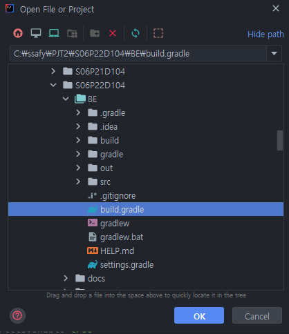
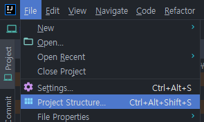
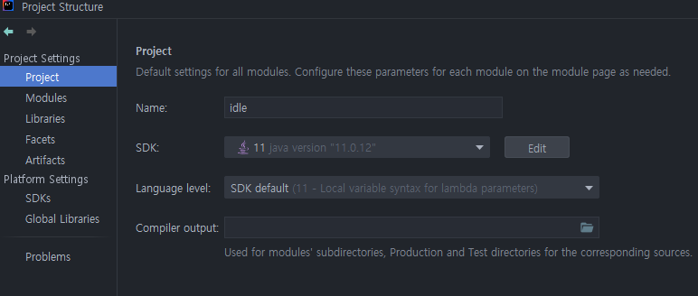
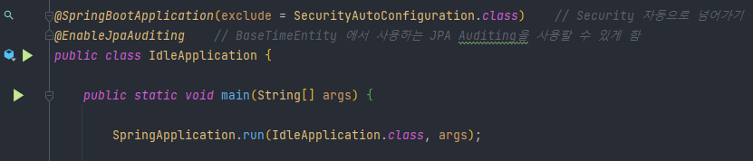
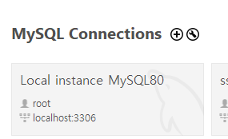
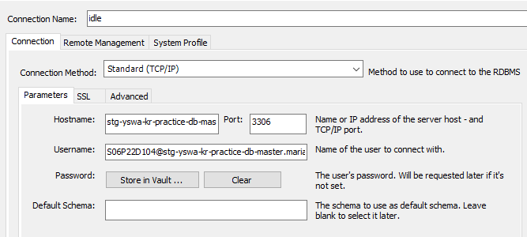

## 목차

- [📋 기술 스택](#📋-기술-스택)

- [💫 빌드 상세 내용](#💫-빌드-상세-내용)
- [🌀 배포 특이사항](#🌀-배포-특이사항)
- [🛒 DB 계정](#🛒-DB-계정)
- [💎 프로퍼티 정의](#💎-프로퍼티-정의)
- [🌐 외부 서비스](#🌐-외부-서비스)

<br><br>

## 📋 기술 스택

1. 이슈관리 : 
2. 형상관리 : 
3. 커뮤니케이션 : 
4. 개발 환경
   - OS : 10
   - IDE
     -  2021.3.1
     -  1.66.0
     - UI/UX : 
   - Database : 
   - Server : 
     -   
5. 상세 사용
   - Backend
     -   (Zulu Open JDK 11)
     -   (Spring Boot 2.4.5)
     -  7.4
     -  </img>, </img>3.0.0, </img>
   - Frontend
     -  (ES6)
     -  
     -  
     -  
   -  AWS EC2
     -  
     -  
   - Big Data
     -  1.6.0
     -  
     -  3.6

<br><br>

## 💫 빌드 상세 내용

> git clone 이후 빌드의 상세 내용을 정리하였습니다.

<br>

### Backend 빌드

1. build.gradle 혹은 BE폴더로 프로젝트를 엽니다.

   

<br>

2. File > Project Structure > Project, Modules, SDKs

   > JDK 버전이 11인지 확인합니다.



​	

<br>

3. IdleApplication.java를 실행합니다.

   

<br><br>

### Frontend 빌드

1. node_modules를 위한 기본 install

   ```react
   npm i
   ```

2. npm 빌드

   ```react
   npm run build:dev
   ```

3. npm 시작

   ```react
   npm run dev
   ```

<br><br>

## 🌀 배포 특이사항

- next.js 서버(포트번호 : 3001)를 사용해서 Spring Boot(포트번호 : 8443)에 접근합니다.

<br><br>

## 🛒 DB 계정

1. MySQL WorkBench 추가 ("+" 버튼)

   

<br>

2. EC2 계정 정보 넣기



- Connection Name : `idle`
- Hostname : EC2 public url 주소
- Port : `3306`
- Username : [Maria DB User Name]@[Hostname]
- Password > Store in Vault : 유저 비밀번호 `ssafy`

<br><br>

## 💎 프로퍼티 정의

1. NGINX 설치

   ```java
   apt-get update
   apt-get install nginx
   ```

2. NGINX 설정

   ```java
   sudo vim /etc/nginx/sites-available/default
   ```

   ```java
   server {
   	server_name j6d104.p.ssafy.io;
   
   	location / {
   	 proxy_pass http://localhost:3001;
   	 proxy_set_header Host $host;
   	}
   
       listen 443 ssl; # managed by Certbot
       ssl_certificate /etc/letsencrypt/live/j6d104.p.ssafy.io/fullchain.pem; # managed by Certbot
       ssl_certificate_key /etc/letsencrypt/live/j6d104.p.ssafy.io/privkey.pem; # managed by Certbot
       include /etc/letsencrypt/options-ssl-nginx.conf; # managed by Certbot
       ssl_dhparam /etc/letsencrypt/ssl-dhparams.pem; # managed by Certbot
   
   }
   server {
       if ($host = j6d104.p.ssafy.io) {
           return 301 https://$host$request_uri;
       } # managed by Certbot
   
   	listen 80;
   	listen [::]:80;
       	return 404; # managed by Certbot
   
   }
   ```

   - j6d104.p.ssafy.io 로 접속 시 Next.js 서버인 3001번 Port로 연결합니다.
   - HTTPS 적용을 위해 Certbot을 사용합니다.
   - 만약, http://j6d104.p.ssafy.io로 접근 시 https로 들어갈 수 있도록 리다이렉트 해줍니다.

<br><br>

## 🌐 외부 서비스

- 구글 로그인, 구글 메일 SMTP