# CI/CD

### ❌Docker 사용했을 때

---

[CI/CD (Docker 사용)](https://www.notion.so/CI-CD-Docker-4697527e141f4a0e8521a49922856b04)

### 📍참고사이트

---

[[Jenkins] Docker를 활용한 Spring boot 프로젝트 CI & CD](https://skyblue300a.tistory.com/14)

# 💡EC2 포트

- Jenkins : 8081
- REST API (Spring Boot) : 8080
- MariaDB : 3306
- 웹서버 기본 포트(nginx) : 80

# ↗️SSH 접속

---

```java
ssh -i J6D104T.pem ubuntu@j6d104.p.ssafy.io
```

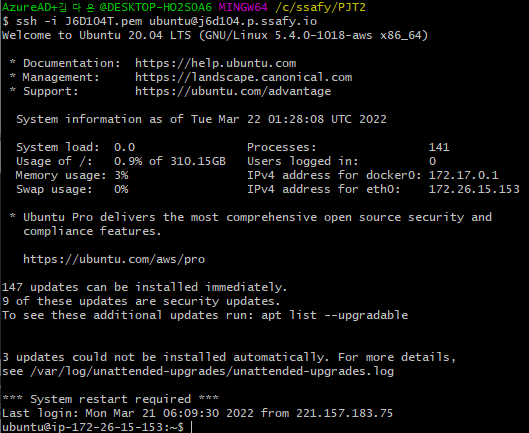

# 🔶Jenkins

---

[](http://j6d104.p.ssafy.io:8081/)

- id : ssafy
- pw : ssafy

# Gitlab Webhook

---

[SSAFY](https://lab.ssafy.com/s06-bigdata-rec-sub2/S06P22D104/-/hooks)

# Jenkins 빌드 시 npm install 에러

---

```powershell
# nodejs를 nvm으로 설치
nvm install 16.13.0
```

### 에러 목록

- /usr/bin/env 에서 node 를 찾는 문제 발생

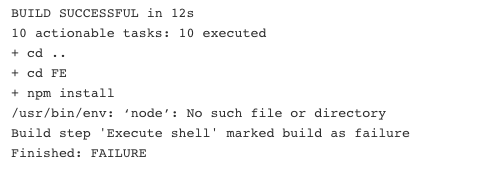

 

### 해결 방법

- node가 깔린 위치를 심볼릭 링크로 생성

```powershell
ln -s /hone/ubuntu/.nvm/versions/node/v16.13.0/bin/node /usr/local/bin/node
```


# Jenkins 설치

---

1. Jenkins 리포지토리 키를 다운로드하여 설치
   
    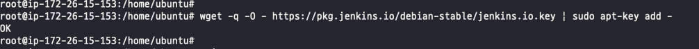
    
2. apt 데이터베이스에 공식 젠킨스 리포지토리 추가
   
    
    
3. apt-get 최신버전으로 업데이트
   
    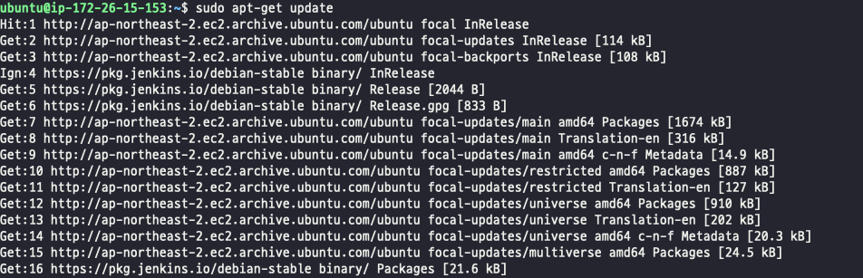
    
4. Jenkins 설치
   
    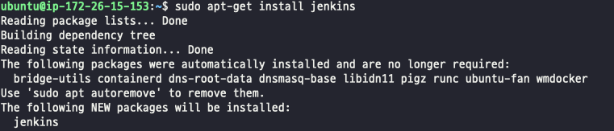
    
5. Jenkins는 기본 8080 포트를 사용하기 때문에 톰캣과 겹친다. 그러므로 Jenkins의 포트 8081를 변경한다.
   
    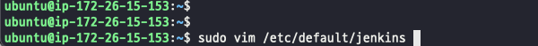
    
    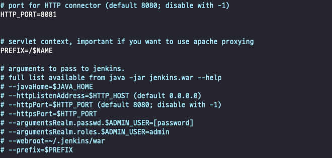
    
6. Jenkins를 사용하려면 Java를 설치해야한다. 이 프로젝트에서는 11을 사용하므로 11을 설치한다.
   
    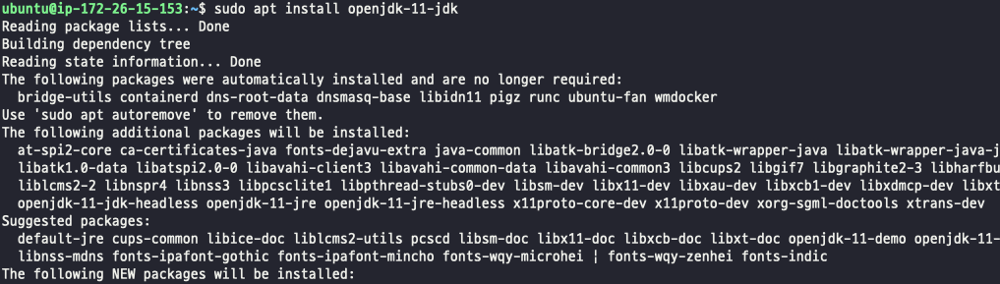
    

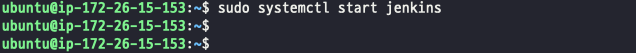

1. Jenkins 실행
   
    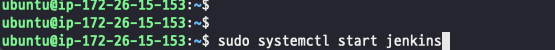
    

# Jenkins, GitLab 설정

---

1. 도메인:8181 주소로 접속
   
    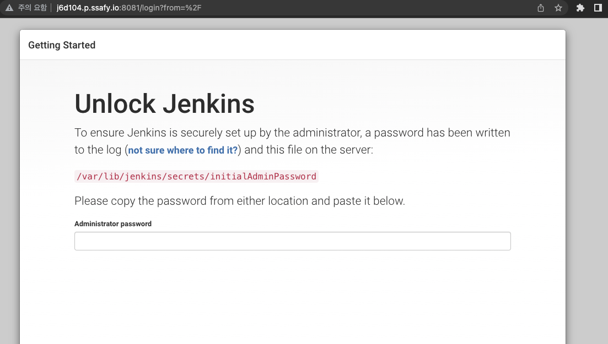
    
2. Jenkins 초기 패스워드 확인
   
    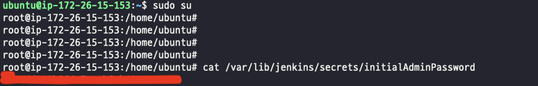
    
3. Jekins 관리 → Global Tool Configuration(EC2에 있는 Java, Git 설정)
   
    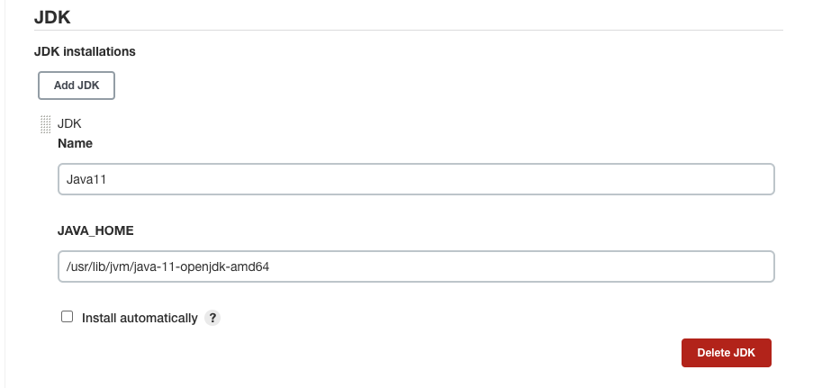
    
    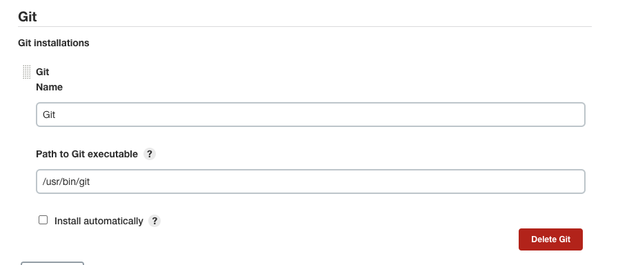
    
4. Jenkins sudo 사용 권한 부여

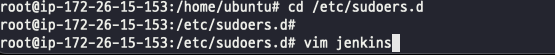

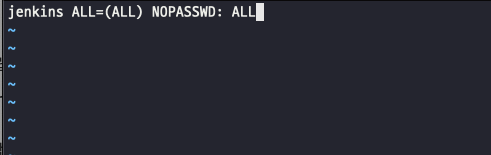


1. Jenkins 관리 → Configure Global Security → Allow anonymous read access 체크

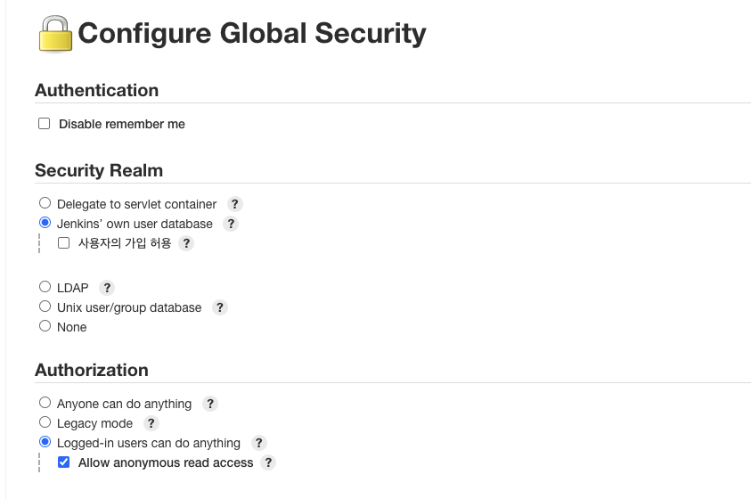

1. Jenkins 관리 → Gitlab, Post build task, MatterMost Nontification 설치

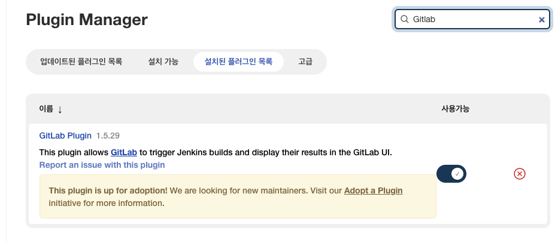

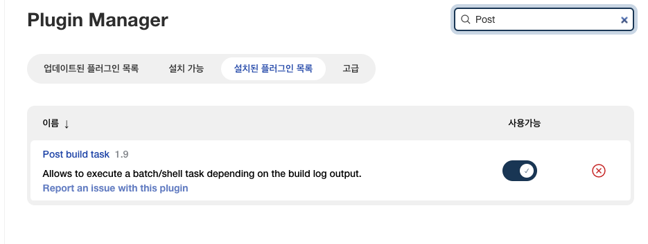

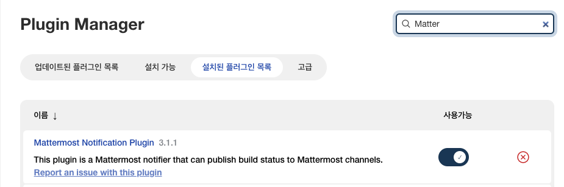

1. 생성한 프로젝트 → 구성
   
    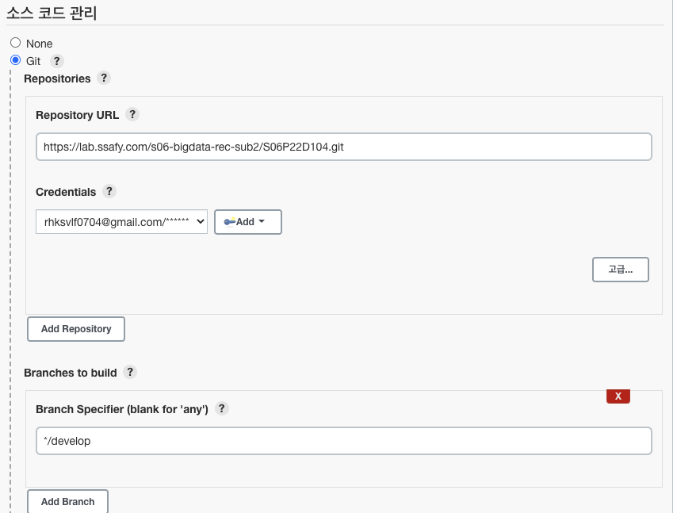
    
    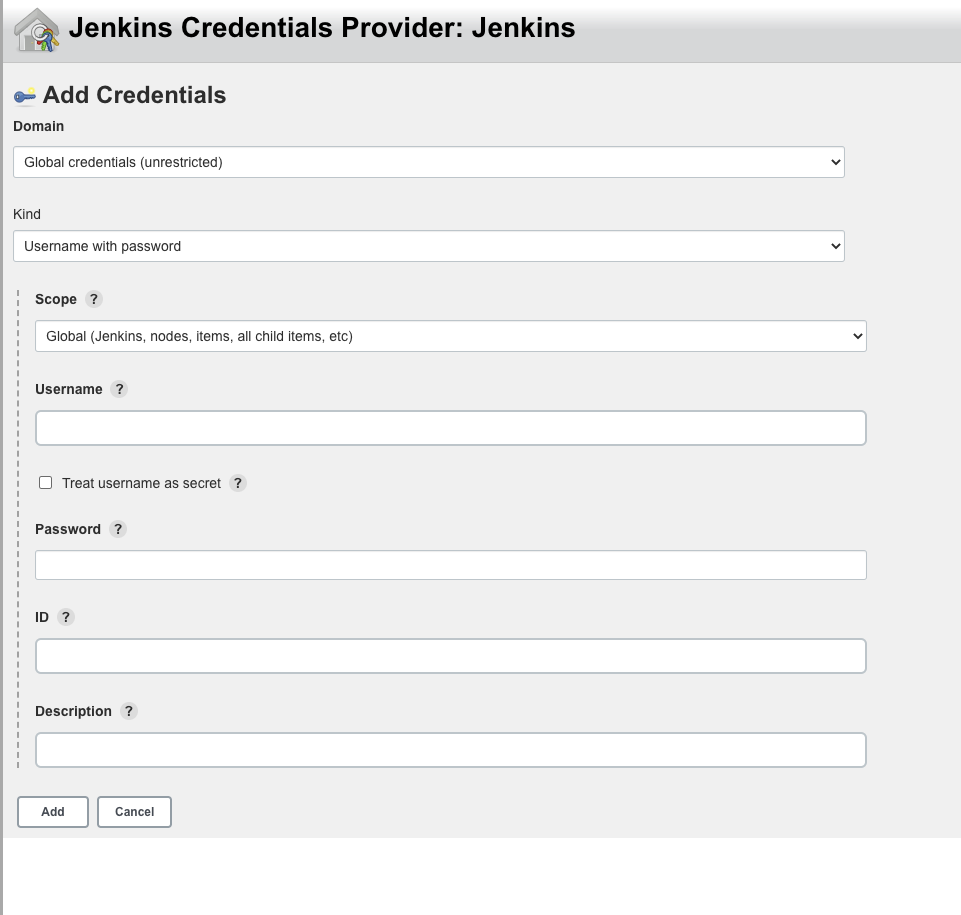
    
    - Repositroy URL : Gitlab 레포지토리 주소
    - Credential → Add 클릭
        - Username : Gitlab 아이디
        - password : Gitlab 패스워드
        - ID : Jenkins의 내의 Credential 구분하기 위한 식별자
    - Branch는 원하는 브랜치로 변경
    
    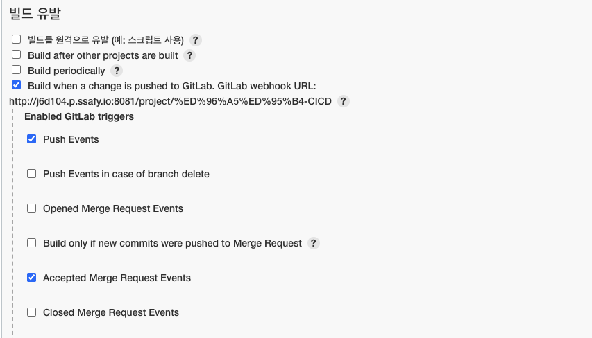
    
    - Build only if new commits ... 체크 해제
    - Accepted Merge ... 체크

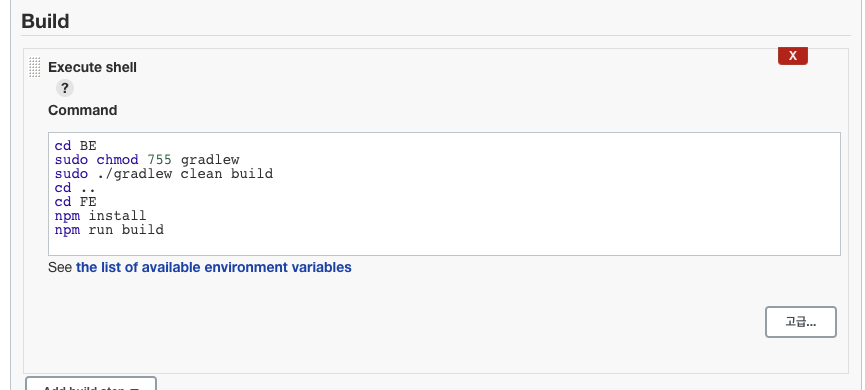

- Build는 프로젝트 마다 자율적으로 설정

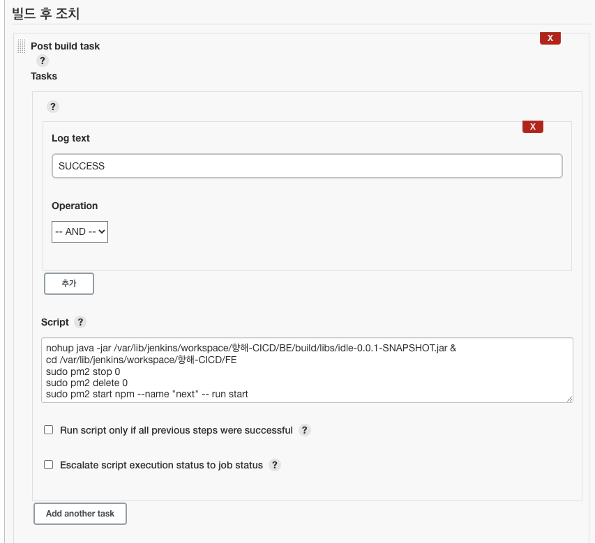

- 빌드 후 조치 또한 Post build task로 프로젝트에 따라 자율적으로 작성

# Nginx 설치, 설정

---

1. Nginx 설치
   
    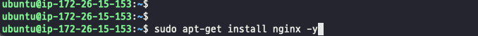
    
2. default 파일 설정
   
    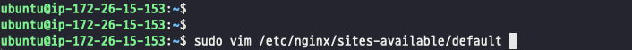
    
    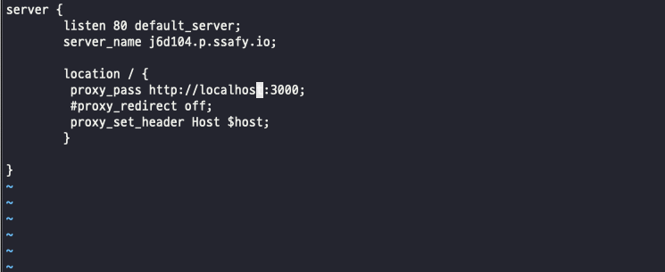
    
3. Nginx 재시작
   
    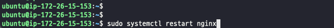
    

# Pm2 설치

---

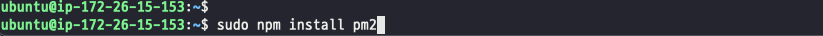

- Next.js를 백그라운드로 돌리기 위해 사용

# HTTPS 적용

---

1. Certbot 설치
    - 레포지토리 등록
      
        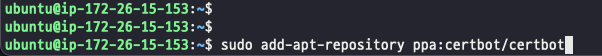
        
    - Certbot 설치
      
        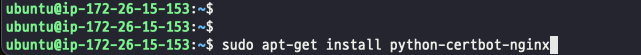
        

1. SSL 인증서 발급
    - 인증서 발급
      
        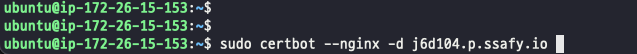
        
    - 이메일 등록과 약관에 동의하면 기존 http 연결을 어떻게 설정할 것인가에 대한 질문이 나온다.
        - 1 : http 연결을 https로 리다이렉트 하지 않는다.
        - 2 : http 연결을 https로 리다이렉트 시킨다.
    - 1 or 2를 입력하고 엔터를 누르면, 구성이 업데이트 되고 Nginx 서버가 재시작된다.
    - 터미널에 다음과 같은 메세지가 나오는지 확인!
      
        
