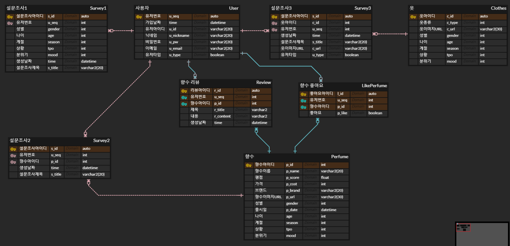

# ERD

[향해](https://www.erdcloud.com/d/896iJQQkcoes3PjQv)

## MySql 수정버전

- User 
    - u_seq : 유저 고유번호
    - create_date : 생성일
    - u_email : 유저 이메일
    - u_id : 유저 아이디
    - u_nickname : 유저 닉네임
    - u_pw : 유저 비밀번호
    - u_type : 유저 타입
    
- Survey1
    - s_id  : 설문조사1 고유번호
    - u_seq : 설문조사 작성자  고유번호
    - s_title : 설문조사 제목
    - create_date : 생성일
    - gender : 성별
    - mood : 분위기
    - season : 계절
    - time : 밤/낮
    - tpo :  상황
    
- Survey2
    - s_id  : 설문조사2고유번호
    - u_seq : 설문조사 작성자  고유번호
    - s_title : 설문조사 제목
    - p_id :  사용해본 향수 고유번호
    
- Survey3
    - s_id  : 설문조사3고유번호
    - u_seq : 설문조사 작성자  고유번호
    - s_title : 설문조사 제목
    - c_url :  옷 이미지 url
    - st_id : 스타일 고유번호
    
- Style
    - st_id : 스타일 고유번호
    - mood : 분위기
    - tpo : 상황
    
- LikePerfume
    - p_id : 향수 고유 번호
    - u_seq : 좋아요 작성자  고유번호

- Review
    - p_id : 향수 고유 번호
    - u_seq : 좋아요 작성자  고유번호
    - create_date : 생성일
    - r_cotent : 리뷰 내용
    - r_title : 리뷰 제목
    - r_score : 리뷰 평점
    
- Perfume
    - p_id : 향수 고유 번호
    - u_seq : 좋아요 작성자  고유번호
    - p_group : 향수 그룹
    - note1 :  향수 메인노트1
    - note2 : 향수 메인노트2
    - note3 : 향수 메인노트3
    - p_brand : 향수 브랜드
    - p_name : 향수 이름
    - p_score : 향수 평점 평균
    - gender : 성별
    - mood : 분위기
    - season : 계절
    - time : 밤/낮
    - tpo :  상황